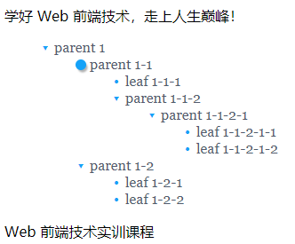
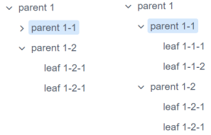

*本文为原生JS实现的网页树形列表组件的实验文档*

 ## 实现效果

实现效果

---

目标效果

---

**一些说明**：根据目标效果和功能，**点击节点右侧的图标控制子节点的收起和展开，点击节点的标题触发回调函数**；同时应用动画过渡和样式渐变，enjoy!

## 实现思路与问题解决

实现树形列表组件的过程主要分为四个阶段：

### 1. 生成结构

生成树形结构的代码在.js文件中为类方法的generate部分，这里递归地为传入的root元素构建图标和标题和子节点的容器，并为它们初始化样式。这里遇到的主要问题是要先熟悉DOM操作，由于课上讲的DOM操作内容不多，所以课下花了一定的时间学习，在理解了对元素的获取和属性设置等操作之后，这一阶段的工作很快完成。

### 2.添加事件

由于动画部分是最后做的，这一部分主要是给节点图标和标题增加展开与收缩，点击回调事件，这里主要是一些样式的设计和DOM操作的扩展，如获取元素的孩子元素或者双亲节点，样式更改等，课件上也有很多范例可以学习，所以没有遇到什么太大的问题。

### 3. 动画过渡

这部分花了大量的时间，一开始我尝试使用setInterval等方法，想直接根据时间改变列表高度，但尝试多次发现这种方法只能用于一些可以固定高度的元素（如div），在ul和li原始内部的height属性是没有初始化的，而初始化时又不能直接设置height，因为输入root是未知参数，而且美观性也不好。我还尝试了其他方法，如设置maxHeight等，最后发现结果没有什么太大的变化。之后我又学习了一波css的transition，想利用css的样式过渡直接达到这个效果，但是transition的应用范围实在太小，过渡的目标只有在伪类之间，依然无法用于ul子元素的展开和收缩。所以动画过渡这部分一直困扰了我很长时间，直到我发现一个css3强大的功能@keyframes规则，通过 @keyframes 规则，能够创建动画。创建动画的原理是，将一套 CSS样式逐渐变化为另一套样式。在动画过程中，还能够多次改变这套CSS 样式。并以百分比来规定改变发生的时间，再使用trasnform: scale样式对元素的视觉显示进行变换。尽管trasnform: scale不改变文件流，也就是元素占用的空间不改变，但只要再动画的最后使用display:none加上一些时间控制条件便可巧妙地解决此问题，而且也方便展开或收起的条件判断。所以最后终于解决了动画过渡的问题，可喜可贺。

### 4. 样式优化

完成了所有结构性工作后，剩下就是尽量美化组件细节和考虑用户体验了。我的设计思路是：在节点图标上，非叶节点展开和收缩时不同的箭头朝向是给用户提示的重要功能，叶节点图标则用小圆点，使风格整齐划一，这里要尽量简洁，不能喧宾夺主，而若要点击节点图标进行展开时，图标又不能显示地过小，所以采用了悬停样式改变为按钮的方法，并为其增加阴影以凸显立体感。节点标题初始，悬停，点击颜色尽量相近，但也要凸出一些区别，这是我从iView上的其他组件设计上提取的一些相似性。在这些基础上代码风格尽量简明易懂，样式根据：‘组件-状态-功能’的格式命名。以追求不断的完善。

## 结语

此次组件的设计用时一天，原本因为设计组件而已，不需要很多时间，但做着做着感觉一个组件设计确实是很费工夫的，然而通过这个组件的设计我也进一步了解了JS这门语言的使用和熟悉了DOM操作，尽管遇到了许多问题，但最后都还是一一解决了，最终设计出来也很有成就感，感觉收获非常大。

